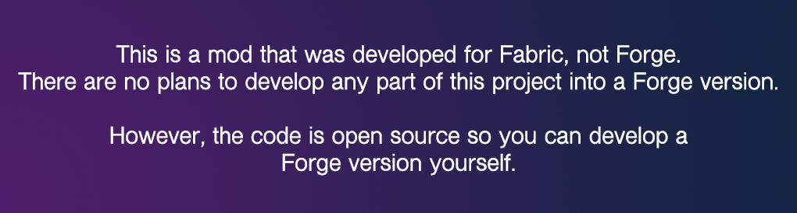
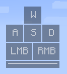
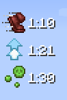
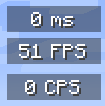
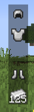
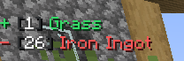
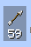
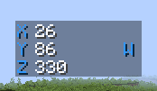
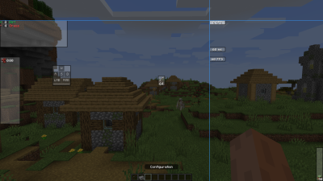
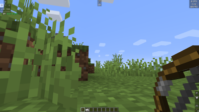

# KronHUD

A mod to add clean and useful HUD widgets.

***This mod is currently in early beta, things may not look/work correctly.***

Download this mod on [CurseForge](https://www.curseforge.com/minecraft/mc-mods/kronhud).

Requires [DarkKore](https://www.curseforge.com/minecraft/mc-mods/darkkore) and Minecraft 1.19.

## Widgets

Currenty KronHUD has: 

- Keystrokes
- Item Updates
- Crosshair
- Ping
- FPS
- CPS
- Potions
- Armor
- Arrow Counter
- Coordinates
- Scoreboard
- Boss bar
- Action bar
- Server IP
- Speedometer
- Player Model
- Game Clock
- IRL Clock

All modules can be moved around freely, and have snapable movement so you can get everything in line!

Colors are customizable too!

More modules are planned to be added. Make sure you add a feature request if you have any ideas! 

## Images

## To compile

Open a terminal and run `./gradlew build`.

## Credits

- DarkKronicle - Developer for KronHUD
- Chronos22 - Created logo
- qsefthuopq - Created Chinese translations
- TheKodeToad - Contributor (also has mouse movement HUD from [Sol Client](https://github.com/Sol-Client/))
- moehreag - Contributor
